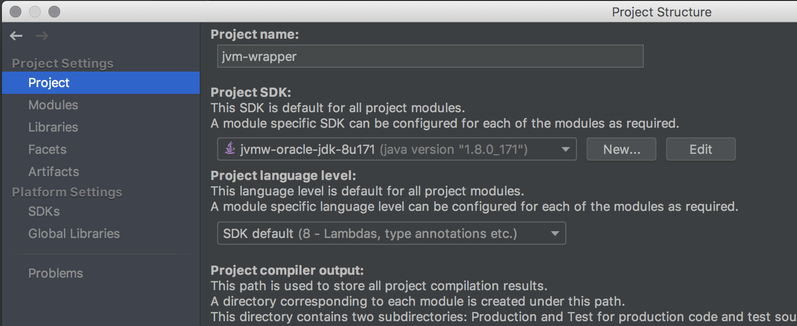
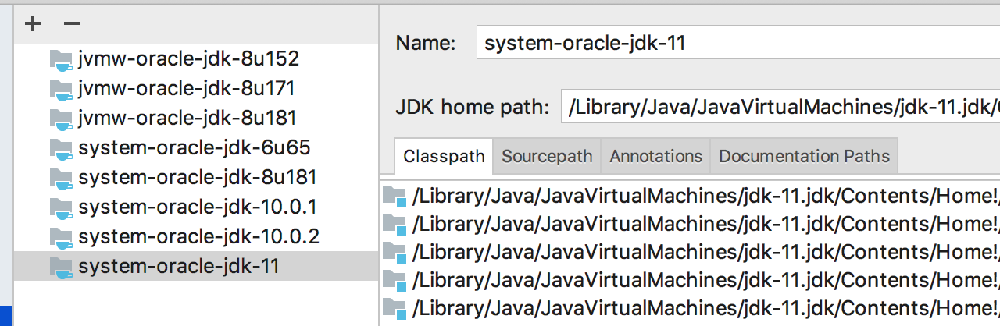

# JVM Wrapper plugin

The plugin adds JVM Wrapper support for IDEA.

[JetBrains Plugin Repository](https://plugins.jetbrains.com/plugin/10760-jvm-wrapper-support)

## Screenshots

### What can
* Download the latest version of JDK from oracle.com (without authorization)
* Install the required JDK in the project when changing the settings of `jvmw.properties`

### What is planned to add
* Download JDK archived versions
* Show the vendor license acceptance dialog before downloading
* Download not only for MacOS, but also for Linux / Windows
